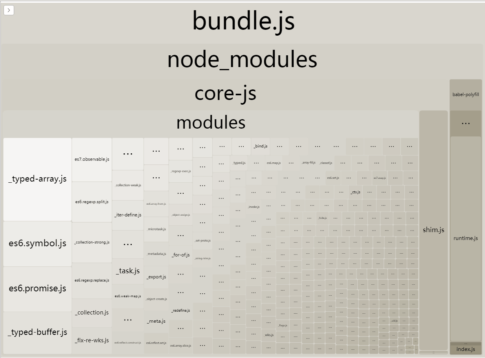
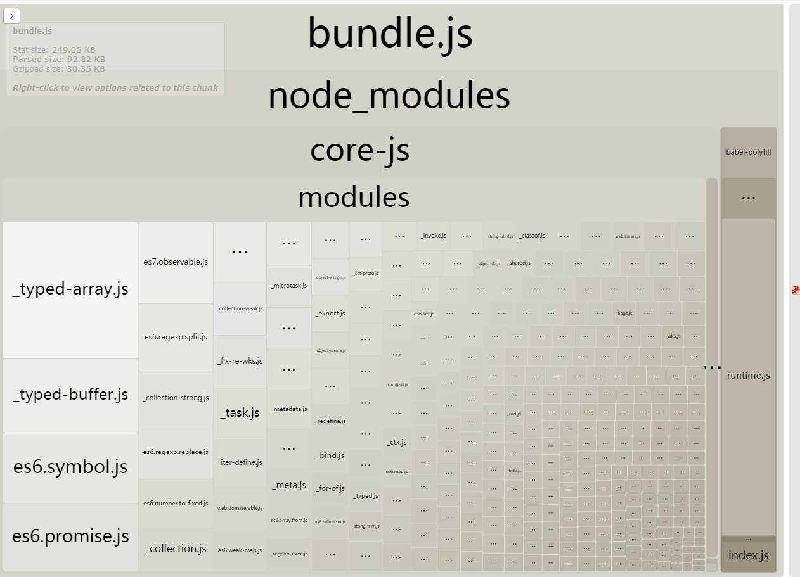
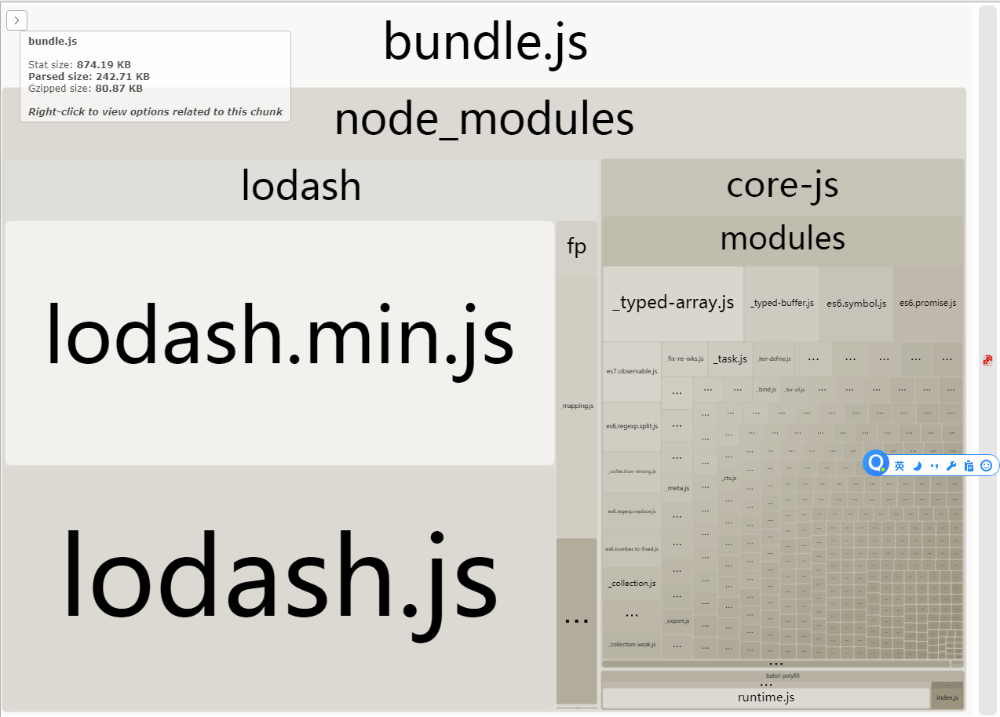
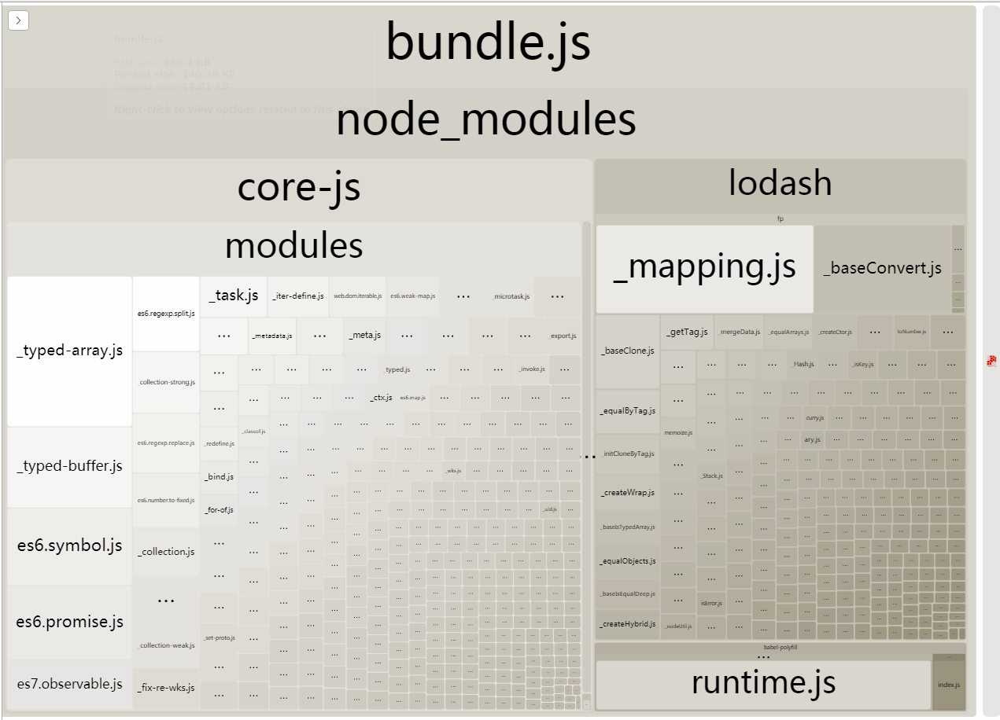
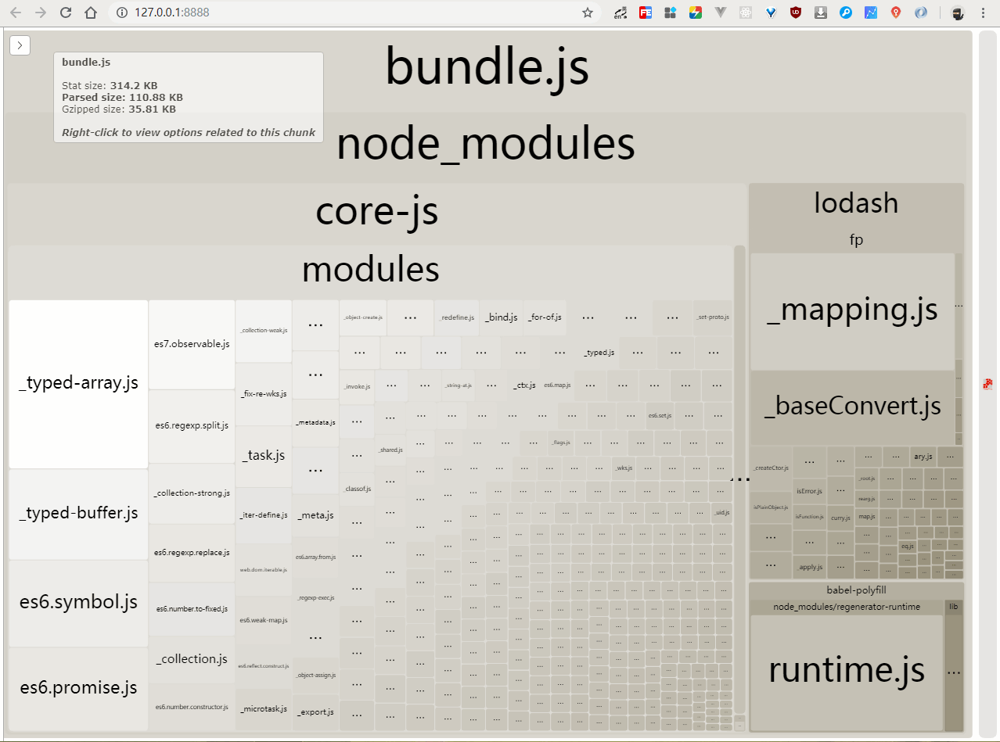

# webpack 性能优化：tree-shaking

## tree-shaking 是什么及作用

> 日常开发中会引入大量库，也有可能使用一部分功能呢个，tree shaking 的作用就是删除掉没有使用的代码（dead code），减少打包后的代码量

## tree-shaking 的原理

1. ES6 的 import 是静态分析的，可以在编译的时候正确判断到底加载了什么代码，可以判断哪些变量未被使用，进而删除未用到代码，[Tree-Shaking 性能优化实践 - 原理篇](https://juejin.im/post/5a4dc842518825698e7279a9) 这篇讲的很详细
2. 可见 tree shaking 的工作前提是：`采用ES6的模块语法`

## 执行

```bash
npm install
npm run step7
```

## tree shaking 的简单使用

### .babelrc

```txt
{
  "presets": [
    [
      "env",
      {
        "modules": false
      }
    ]
  ],
  "plugins": ["transform-runtime"]
}

```

### webpack.config.js

```js
const path = require('path');
module.exports = {
  mode: 'production',
  entry: ['babel-polyfill', path.join(__dirname, './src/index.js')],
  output: {
    path: path.join(__dirname, './bundle'),
    filename: 'bundle.js'
  },
  module: {
    rules: [
      {
        test: /\.js$/,
        use: ['babel-loader'],
        include: path.join(__dirname, 'src'),
        exclude: /node_modules/
      }
    ]
  }
};
```

## 效果

1. 没有使用 tree shaking



2. 使用了 tree shaking



## lodash 在 webpack 中的各项优化

> lodash 本身提供了 lodash-es 的 es6 module 格式，但是我配合 tree shaking 用了，发现减少的并不明显，再加上如果使用[lodash/fp](https://github.com/lodash/lodash/blob/npm/fp.js)模块，会额外引入 lodash.min.js，[issue](https://github.com/lodash/lodash/issues/3079#issuecomment-289884911)上说是提升解析速度。对于这种情况，可以使用[babel-plugin-lodash](https://github.com/lodash/babel-plugin-lodash)和[lodash-webpack-plugin](https://github.com/lodash/lodash-webpack-plugin)进行优化

### .babelrc

```txt
{
  "presets": [
    [
      "env",
      {
        "modules": false,
        "targets": { "node": 6 }
      }
    ]
  ],
  "plugins": ["transform-runtime", "lodash"]
}

```

### webpack.config.js

```js
const path = require('path');
// 查看webpack bundle.js文件引用的模块大小
const BundleAnalyzerPlugin = require('webpack-bundle-analyzer').BundleAnalyzerPlugin;
// 减少lodash的体积的插件
const LodashModuleReplacementPlugin = require('lodash-webpack-plugin');
module.exports = {
  mode: 'production',
  entry: ['babel-polyfill', path.join(__dirname, './src/index.js')],
  output: {
    path: path.join(__dirname, './bundle'),
    filename: 'bundle.js'
  },
  module: {
    rules: [
      {
        test: /\.js$/,
        use: ['babel-loader'],
        include: path.join(__dirname, 'src'),
        exclude: /node_modules/
      }
    ]
  },
  plugins: [
    new BundleAnalyzerPlugin(),
    new LodashModuleReplacementPlugin({
      collections: true,
      paths: true
    })
  ]
};
```

### 效果

1. 只用 tree shaking



2. 使用了 tree shaking 和 babel-plugin-lodash



3. 使用了 tree shaking、babel-plugin-lodash 和 lodash-webpack-plugin


