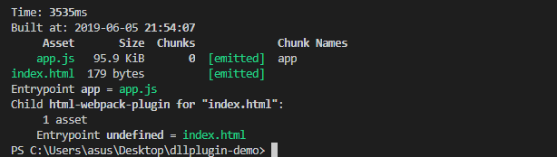
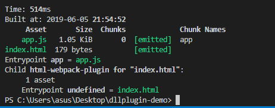

# webpack 优化:DllPlugin

## DllPlugin

1. `dll 是什么：`dll 类似于 windows 系统的 dll，一个 dll 文件就是一个动态链路库
2. `dll 的原理：`将依赖的模块打包到动态链路库中，一个动态链路库包含多个模块，这些模块从动态链路库中获取，不会重复打包，页面依赖的动态链路库都要提前写入。
3. `dll的目的：`提升构建速度

## webpack 中如何使用

- 第一步：webpack.dll.config.js

```js
const path = require('path');
const webpack = require('webpack');
module.exports = {
  mode: 'production',
  resolve: {
    alias: {
      jquery: path.resolve(__dirname, 'src', 'jquery')
    },
    extensions: ['.js']
  },
  entry: {
    // 核心步骤1
    // 定义程序中打包公共文件的入口文件vendor.js
    vendor: [path.resolve(__dirname, 'src', 'vendor.js')]
  },
  output: {
    path: path.join(__dirname, 'dist'),
    filename: '[name].dll.js',
    library: '[name]_[hash]',
    libraryTarget: 'this'
  },
  plugins: [
    // 核心步骤2
    new webpack.DllPlugin({
      context: __dirname,
      path: path.join(__dirname, 'dist', '[name]-manifest.json'),
      name: '[name]_[hash]'
    })
  ]
};
```

- 第二步：webpack.config.js

```js
const path = require('path');
const HtmlWebpackPlugin = require('html-webpack-plugin');
const webpack = require('webpack');

module.exports = {
  mode: 'production',
  entry: {
    app: path.resolve(__dirname, 'src', 'main.js')
  },
  output: {
    path: path.resolve(__dirname, 'dist'),
    filename: '[name].js'
  },
  resolve: {
    alias: {
      jquery: path.resolve(__dirname, 'src', 'jquery')
    },
    extensions: ['.js']
  },
  plugins: [
    // 核心步骤
    new webpack.DllReferencePlugin({
      context: process.cwd(),
      manifest: require(path.join(__dirname, 'dist', 'vendor-manifest.json'))
    }),
    new HtmlWebpackPlugin({})
  ]
};
```

- 第三步：src/index.html

```html
<!DOCTYPE html>
<html lang="en">
  <head>
    <meta charset="UTF-8" />
    <meta name="viewport" content="width=device-width, initial-scale=1.0" />
    <meta http-equiv="X-UA-Compatible" content="ie=edge" />
    <title>Document</title>
  </head>
  <body>
    <script type="text/javascript" src="./dist/vendor.dll.js"></script>
  </body>
</html>
```

- 第四步：src/vendor.js
  > 引入的公共模块如果在 vendor 中有被引用过，那么编译的时候直接使用静态文件 vendor.dll.js

```js
import 'jquery';
```

## 执行

```bash
npm install
# 第一步
npm run dll
# 第二步
npm run build
```

## 实现效果

- 直接 build，时间为 3535ms



- 使用 dll，时间为 514ms



## 参考

[DllPlugin - Webpack 中文文档](https://webpack.docschina.org/plugins/dll-plugin/)
