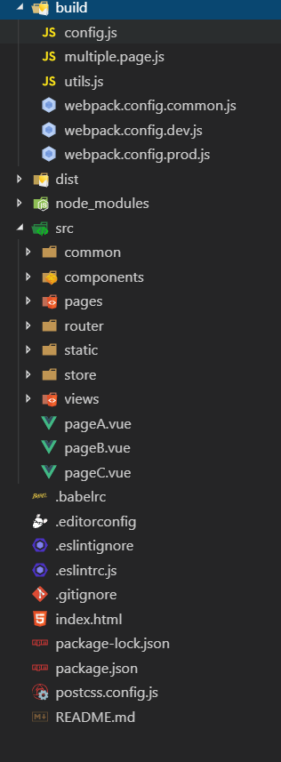

# webpack4 多页面（.vue 版本）

## 多页面入口

1. vue-cli3 脚手架生成的配置是单页的，但是我们也会有多页面的需求，比如一个增值服务系统下有若干个收费产品，使用多页就不用每次都新开一个项目
2. 我写的这个脚手架开箱即用，可以自定义页面，在`pages`下写入若干个 js，就会生成若干个多页 html，其中还可以自定义多页的模版
3. 没有写入太多的业务逻辑，比如 mock 数据、axios 的封装，px 转 rem 等，这些可以根据自己的实际需求，按需填写

## 项目目录



## 适用场景

1. 增值服务下有若干个收费产品
2. 多页面应用
3. ...

## 实现功能

1. 多页面入口
2. 生产环境和开发环境互相独立
3. HRM
4. HTML/JS/CSS/LESS 代码打包构建
5. webpack-dev-server
6. 静态文件管理
7. 自动清理构建目标产物
8. 移动端 css px 自动转成 rem
9. eslint 语法检测
10. 解析图片，ttf，MP4 等媒体文件
11. 支持 ES6/7/8
12. 生产环境 splitChunks
13. 自动补齐 css3 前缀
14. webpack 性能优化，例如编译时出现错误时，使用跳过编译阶段、防止出现错误代码混入，压缩代码时使用多进程并行运行和文件缓存来提高构建速度
15. 友好的输出打包日志
16. babel:转译一些特殊的语法：Promise/Object.assign/Array.from

## 技术栈

1. webpack4
2. babel
3. less/css(不支持 sass/stylus)
4. eslint
5. vue/vue-router/vuex

## 环境

1. webpack v4.19.1
2. nodejs v10.15.3
3. npm v6.4.1

## srcipts

```bash
# 安装依赖
npm install
# 开启开发环境
npm run dev
# 开启生产环境
npm run build
# 开始eslint校验
npm run lint
```
